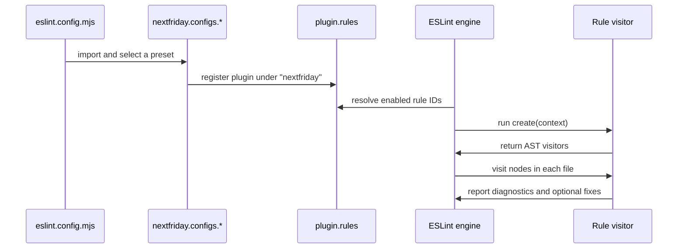

`eslint-plugin-nextfriday` is intentionally centralized. Almost every public behavior starts in `src/index.ts`, which imports each rule module, builds the exported `rules` map, composes preset objects, and exposes two lazy getters for bundled external plugin configs.

## Module Relationships

```mermaid
graph TD
  A[src/index.ts] --> B[meta]
  A --> C[rules map]
  A --> D[configs object]
  C --> E[src/rules/*.ts]
  E --> F[@typescript-eslint/utils RuleCreator]
  E --> G[src/utils.ts]
  D --> H[baseRules]
  D --> I[jsxRules]
  D --> J[nextjsOnlyRules]
  D --> K[sonarjs getter]
  D --> L[unicorn getter]
  K --> M[eslint-plugin-sonarjs]
  L --> N[eslint-plugin-unicorn]
```

## High-Level Structure

The package has one runtime entry point: `src/index.ts`. `package.json` exports that file through generated ESM, CJS, and declaration outputs in `lib/`, so consumers always import from the package root instead of deep paths. Internally, `src/index.ts` gathers 57 default exports from `src/rules/*.ts`, creates a `rules` record keyed by rule ID, and packages it into a plugin object alongside `meta` and `configs`.

Every rule file follows the same shape. The file defines a `createRule` helper by calling `ESLintUtils.RuleCreator(...)`, declares metadata such as `name`, `type`, `description`, `schema`, and `messages`, then returns a `create(context)` visitor object. The helper also standardizes the documentation URL pattern by mapping rule names like `no-emoji` to markdown files such as `docs/rules/NO_EMOJI.md` in the source repo.

## Data Flow



## Design Decisions

### One central entry module

The package keeps public API assembly in `src/index.ts` instead of scattering exports across many files. That makes it easy to reason about what is public: `default`, `meta`, `configs`, and `rules` are the entire surface. It also keeps rule inclusion explicit, because adding a new rule requires importing it and registering it in the `rules` object and any relevant preset groups.

### Preset composition is just object merging

The preset system is deliberately simple. `createConfig` in `src/index.ts` returns an object with `plugins.nextfriday` and a `rules` map, while `react` and `nextjs` presets are built with object spreads over `baseRules`, `jsxRules`, and `nextjsOnlyRules`. That means there is no hidden resolution logic: if you inspect those constants, you can see exactly which rule IDs and severities each preset applies.

### Bundled plugin configs are lazy getters

The `configs.sonarjs` and `configs.unicorn` properties are getters, not static objects. That matters because both configs are arrays, not single config objects, and they pull recommended rules from third-party plugin packages only when accessed. The `unicorn` getter also injects opinionated overrides such as turning off `unicorn/filename-case`, `unicorn/prevent-abbreviations`, and `unicorn/no-null` for JSX/TSX files.

### No runtime options per rule

All 57 rule modules declare `schema: []` and `defaultOptions: []`. The trade-off is intentional: consumers choose behavior by selecting a preset or toggling individual rules, not by learning a second layer of custom option schemas. This keeps the docs and the runtime model straightforward, but it also means project-specific edge cases require turning a rule off rather than tuning it.

## Internal Utility Layer

Only a few helpers live outside rule files. `src/utils.ts` exports filename and parameter helpers such as `isJsFile`, `isJsxFile`, `isConfigFile`, `hasMultipleParams`, and `hasNonDestructuredParams`. These utilities are not re-exported publicly, but several filename-sensitive and function-signature-sensitive rules depend on them to keep rule code focused on AST logic instead of string parsing.

## Lifecycle in Practice

There are three common execution paths:

1. A user imports a preset like `nextfriday.configs.base`, and ESLint runs only this plugin's 40 base rules.
2. A user imports `nextfriday.configs.react` or `nextfriday.configs.nextjs`, which layer JSX-focused rules on top of the base set.
3. A user spreads `...nextfriday.configs.sonarjs` or `...nextfriday.configs.unicorn`, which inject external plugin definitions and rule maps into the same flat-config array.

That architecture keeps the package small in API terms while still covering naming, formatting, imports, typing, React, and Next.js behavior in depth.

<Cards>
  <Card title="Preset Configs" href="/docs/preset-configs">See how the preset layers are composed and when to use each one.</Card>
  <Card title="Rule Families" href="/docs/rule-families">See how the 57 rules are grouped and what each family enforces.</Card>
  <Card title="Plugin API" href="/docs/api-reference/plugin">Inspect the exact exported objects and import paths.</Card>
</Cards>
