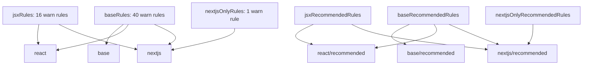

Preset configs are the main way to consume `eslint-plugin-nextfriday`. Instead of enabling dozens of rule IDs manually, you select one of six exported config objects from `src/index.ts` and let the package apply the right rule families and severities together.

## What This Concept Solves

Without presets, adopting the plugin means copying 57 rule IDs into `eslint.config.mjs` and deciding which should be warnings or errors. The preset layer solves that by turning the rule catalog into three environments and two severity levels:

- `base` and `base/recommended`
- `react` and `react/recommended`
- `nextjs` and `nextjs/recommended`

The distinction is mechanical in the source. `baseRules` and `baseRecommendedRules` contain the same 40 rule IDs with different severities, `jsxRules` and `jsxRecommendedRules` add 16 React and JSX rules, and `nextjsOnlyRules` adds the single `nextjs-require-public-env` rule.

## How It Relates to Other Concepts

Presets sit between the plugin object and the rule modules:

- The [Architecture](/docs/architecture) page explains how `src/index.ts` builds the exported `configs` object.
- The [Rule Families](/docs/rule-families) page explains what kinds of rules each layer contributes.
- The [Rule Execution Model](/docs/rule-execution-model) page explains what the enabled rules do when ESLint visits a file.

## How It Works Internally

`src/index.ts` defines a small helper:

```ts
const createConfig = (configRules: Record<string, string>) => ({
  plugins: {
    nextfriday: plugin,
  },
  rules: configRules,
});
```

That function is the entire preset factory. `configs.base` is `createConfig(baseRules)`, `configs.react` is `createConfig({ ...baseRules, ...jsxRules })`, and `configs.nextjs` is `createConfig({ ...baseRules, ...jsxRules, ...nextjsOnlyRules })`. The recommended variants repeat the same composition pattern with `"error"` severities instead of `"warn"`.



The external plugin helpers work differently. `configs.sonarjs` and `configs.unicorn` are getters because they return arrays of flat-config entries and need to read recommended rules from dependency packages. That is why the README and API docs use `...nextfriday.configs.sonarjs` and `...nextfriday.configs.unicorn` instead of plain object insertion.

## Basic Usage

Use the base preset for non-React TypeScript or JavaScript projects:

```js
import nextfriday from "eslint-plugin-nextfriday";

export default [nextfriday.configs.base];
```

## Advanced Usage

Combine the stricter React preset with bundled SonarJS and Unicorn configs:

```js
import nextfriday from "eslint-plugin-nextfriday";

export default [
  nextfriday.configs["react/recommended"],
  ...nextfriday.configs.sonarjs,
  ...nextfriday.configs.unicorn,
];
```

That setup gives you the plugin's base and JSX rules at error level, then layers additional third-party checks and a small Unicorn override for JSX/TSX null handling.

<Callout type="warn">`configs.base`, `configs.react`, and `configs.nextjs` are single config objects. `configs.sonarjs` and `configs.unicorn` are config arrays. If you forget to spread the latter with `...`, ESLint will receive a nested array and the config will be wrong.</Callout>

## Trade-Offs

<Accordions>
<Accordion title="Warn presets vs recommended presets">
The only difference between `base` and `base/recommended`, or between the React and Next.js pairs, is severity. In `src/index.ts`, the rule IDs are mirrored exactly and the values change from `"warn"` to `"error"`. That makes migration predictable, because you can start with warnings to measure noise and then switch to the recommended preset once the codebase is clean. The trade-off is that there is no middle preset with a curated subset of strict rules, so teams wanting a softer rollout still need a manual override layer.
</Accordion>
<Accordion title="Preset convenience vs manual tuning">
Presets are fast to adopt because the package authors already grouped related rules by environment. The downside is that the grouping reflects the plugin author's opinion, not every repository's maturity or architecture. For example, `base` always includes `no-relative-imports` and `require-explicit-return-type`; if your repo cannot satisfy those rules yet, you disable them after importing the preset rather than configuring options. That is still simpler than hand-maintaining 40 rule IDs, but it is less granular than a heavily parameterized plugin.
</Accordion>
<Accordion title="Bundled third-party configs">
Bundling `sonarjs` and `unicorn` as getters reduces installation friction because the dependencies already ship with the package. It also lets `src/index.ts` apply house-style overrides such as disabling `unicorn/filename-case` and `unicorn/prevent-abbreviations`. The cost is that consumers inherit those opinions when they opt in, so they should read the config page before assuming the third-party presets are untouched mirrors of the upstream defaults. In practice this is useful, but it means the bundled configs are a curated distribution, not a transparent pass-through.
</Accordion>
</Accordions>

Choose the smallest preset that matches your runtime environment, then override only the rules that genuinely conflict with local constraints.
