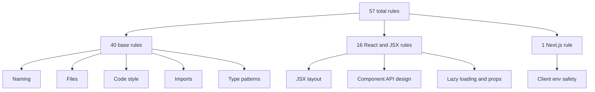

The package's 57 rules are easier to understand as families than as a flat list. `src/index.ts` groups them into a base layer for all projects, a JSX/React layer for component files, and a single Next.js client-side rule. The README then re-groups them by intent: naming, files, style, imports, type patterns, React/JSX, and Next.js.

## What This Concept Solves

When a plugin exposes dozens of rules, users need a mental model for deciding which ones matter to their project. Rule families provide that model:

- Naming rules make identifiers communicate intent.
- File rules align file names with content type.
- Code-style rules push structure into readable, reviewable shapes.
- Import and type rules make module boundaries and TypeScript declarations more explicit.
- React and Next.js rules add framework-aware safety checks.

## How It Relates to Other Concepts

Rule families are what the preset system actually layers. The [Preset Configs](/docs/preset-configs) page explains how those families become `base`, `react`, and `nextjs`. The [Rule Execution Model](/docs/rule-execution-model) page explains how individual family members inspect AST nodes and sometimes apply fixes.

## Family Breakdown

### Base Families

The base preset covers 40 rules spread across these categories:

- Variable and naming rules such as `boolean-naming-prefix`, `enforce-camel-case`, `enforce-constant-case`, and `no-lazy-identifiers`
- File rules such as `file-kebab-case`
- Code-style rules such as `prefer-function-declaration`, `no-env-fallback`, `newline-before-return`, and `prefer-guard-clause`
- Import rules such as `no-relative-imports`, `prefer-import-type`, `sort-imports`, and `sort-exports`
- Type-pattern rules such as `enforce-type-declaration-order`, `prefer-inline-type-export`, and `sort-type-required-first`

### React and JSX Families

The React presets add 16 rules from `jsxRules` in `src/index.ts`. These are not only about JSX formatting; they also encode component API design conventions. For example, `enforce-props-suffix` and `enforce-readonly-component-props` shape prop types, `jsx-require-suspense` checks lazy component boundaries, and `react-props-destructure` enforces a component-body destructuring style.

### Next.js Family

The Next.js layer adds one rule: `nextjs-require-public-env`. It is intentionally narrow and only triggers in files that begin with `"use client"`, where client-side environment variable exposure matters.



## How It Works Internally

In `src/index.ts`, the grouping is data, not metadata. Each family is represented by a plain object that maps `nextfriday/<rule-id>` to `"warn"` or `"error"`. ESLint never receives a special "family" abstraction; it only sees the final merged `rules` record from the chosen preset. That matters because you can always import a preset and then selectively turn off one family member without fighting extra plugin logic:

```js
import nextfriday from "eslint-plugin-nextfriday";

export default [
  {
    ...nextfriday.configs.react,
    rules: {
      ...nextfriday.configs.react.rules,
      "nextfriday/react-props-destructure": "off",
    },
  },
];
```

## Basic Usage

Choose a preset that matches your file types:

```js
import nextfriday from "eslint-plugin-nextfriday";

export default [nextfriday.configs.react];
```

That preset enables both the 40 base rules and the 16 React/JSX rules, but it does not enable the Next.js client environment check.

## Advanced Usage

Use a manual composition to adopt only a few rule families during migration:

```js
import nextfriday from "eslint-plugin-nextfriday";

export default [
  {
    plugins: {
      nextfriday,
    },
    rules: {
      "nextfriday/no-single-char-variables": "warn",
      "nextfriday/no-lazy-identifiers": "warn",
      "nextfriday/boolean-naming-prefix": "warn",
      "nextfriday/no-relative-imports": "warn",
      "nextfriday/sort-imports": "warn",
      "nextfriday/enforce-readonly-component-props": "warn",
      "nextfriday/jsx-require-suspense": "error",
    },
  },
];
```

That pattern is useful when a legacy repository can absorb naming and import rules quickly but is not ready for the full base preset.

<Callout type="warn">The base preset does not include any JSX rules. If your project contains `.tsx` or `.jsx` files and you start from `configs.base`, rules like `jsx-pascal-case`, `jsx-sort-props`, and `enforce-readonly-component-props` will not run until you switch to a React or Next.js preset.</Callout>

## Trade-Offs

<Accordions>
<Accordion title="Broad families reduce decision fatigue">
Grouping rules into environment-focused families makes adoption faster because users do not need to triage 57 switches up front. In practice, most repositories know whether they are plain TypeScript, React, or Next.js projects, so the correct starting point is obvious. The trade-off is that the family boundaries are opinionated: some teams may want React prop-type rules without JSX layout rules, or import ordering without naming rules. The plugin supports that, but only by dropping to manual rule selection.
</Accordion>
<Accordion title="File-based heuristics are easy to apply and easy to surprise">
Several rules rely on filenames or file extensions rather than deep semantic analysis. `file-kebab-case`, `jsx-pascal-case`, `enforce-hook-naming`, and `enforce-service-naming` all infer intent from names like `*.tsx`, `*.hook.ts`, or `*.service.ts`. That keeps the implementations simple and consistent across codebases, but it also means renaming a file can change which rules apply. Teams should document naming conventions early so the lint results feel intentional instead of arbitrary.
</Accordion>
<Accordion title="Framework-specific rules stay isolated">
Keeping React and Next.js rules out of `base` avoids false positives in backend or utility packages. This is visible directly in `src/index.ts`, where only the React and Next.js presets merge `jsxRules` and `nextjsOnlyRules`. The downside is that a mixed monorepo may need separate config entries for different directories if some packages are framework-free and others are UI-heavy. Flat config handles that well, but the repository owner has to make the split explicit.
</Accordion>
</Accordions>

For the exhaustive list of rule IDs, descriptions, and source files, continue to the [Rules API page](/docs/api-reference/rules).
